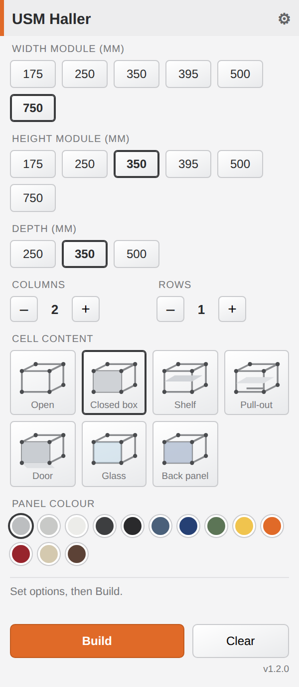

# USM Configurator

A standalone Fusion 360 add-in that builds **USM Haller modular furniture** from a
configuration palette, with the geometry and validation computed by the real
**[usm-engine](https://github.com/smostajeran/usm-engine)** (decoded from the
Perspectix VCML). You choose the bay widths/heights/depth and per-cell content;
the add-in calls the engine's `/api/build`, then materialises the returned parts
— chrome **ball connectors**, **tubes**, levelling **feet**, and steel **panels /
shelves / doors / glass** — in the active design.

It is **independent of the ClaudeCad chat add-in** — its own command, palette and
client — but its builder **reuses ClaudeCad's proven CAD engine** when that add-in
is present, for design binding, unit handling and material assignment.

*The palette uses the engine's own vocabulary: width/height modules
(175/250/350/395/500/750 mm), depth (250/350/500 mm), column/row counts, and the
source-verified cell-content families (Open / Closed box / Shelf / Pull-out /
Door / Glass / Back panel). The ⚙ sets the engine URL.*

## The engine is the source of truth

The add-in does **not** invent USM geometry. On **Build** it sends a *Path P*
configuration — `{columnWidths, rowHeights, depth, cells}` — to the engine's
`POST /api/build` and receives the **IP-safe one52 payload**: parts as
`{id, part, label, family, pos, quat, quad}` with English labels and RealityKit
geometry (metres, Y-up). No USM codes, article numbers or prices are ever sent to
the client — the engine enforces that boundary. The add-in maps each part to a
Fusion primitive (connector→sphere, tube→cylinder, panel/shelf/door/glass→box
from the exact `quad` corners), converting metres/Y-up → Fusion cm/Z-up.

## Workflow

1. **Utilities → Add-Ins → Scripts and Add-Ins → `UsmConfigurator` → Run.** The
   **USM Haller** palette docks on the right.
2. Open **⚙** and set your **usm-engine URL** (defaults to the known deployment)
   and an auth token if your deployment requires one; **Test** checks `/health`.
3. Pick the **Width/Height/Depth** modules, **Columns/Rows**, the **Cell content**,
   and a **Panel colour**.
4. **Build** calls the engine and materialises the parts in the active design;
   the status line shows the part counts and any conflicts the engine flagged.
   **Clear** removes a previous build's bodies.

## How it works

| Piece | Responsibility |
|-------|----------------|
| `UsmConfigurator.py` | Fusion entry point (`run`/`stop`); fresh-imports the package each Run. |
| `usm/engine_client.py` | **Pure stdlib** HTTP client for the engine's `/api/build` and `/health`. |
| `usm/payload.py` | **Pure** mapping: engine payload → Fusion primitives (metres/Y-up → cm/Z-up, tube axis from the quat, `quad`→box). Unit tested against a real captured payload. |
| `usm/builder.py` | Fusion build: spheres/cylinders/boxes via `TemporaryBRepManager`, colours/materials. Reuses ClaudeCad's engine. |
| `usm/ui.py` | Hosts the HTML palette, bridges its events, calls the engine off the main thread, and builds on it. |
| `usm/config.py` | Engine URL/token settings (`~/.usmconfigurator/config.json`, env overrides). |
| `usm/addin.py` | Add-in lifecycle (create/remove the command + palette). |
| `resources/palette/` | The configurator palette UI (HTML/CSS/JS, own SVG icons). |
| `usm/geometry.py`, `usm/presets.py` | A self-contained offline fallback layout + preset catalogue (used by the preview renders / offline tests; the live path uses the engine). |

The client and payload-mapping layers are Fusion-free, so the contract is tested
without the host: `python tests/test_payload.py` checks the mapping against a real
`/api/build` payload (`tests/fixtures/engine_build_sample.json`).

### Reusing the ClaudeCad engine

`usm/builder.py` imports `claudecad.cad.CadBuilder` (the engine that powers the
ClaudeCad add-in) and uses it for the mm→cm unit constant and for assigning a
physical material to the built bodies. It first tries a normal import, then looks
for a sibling `ClaudeCad/` add-in folder and adds it to `sys.path`. If the engine
isn't found, the builder runs **standalone** with local fallbacks (geometry is
identical; materials become best-effort) and says so in its report.

## The model

* **Grid** — `columns`, `rows` and `depths` are lists of bay sizes (mm) along
  X (width), Z (height) and Y (depth). Node coordinates are their running sums,
  so a 2-column × 1-row × 1-deep config has a 3 × 2 × 2 node grid.
* **Balls** — a chrome sphere (default Ø 25 mm) at every node.
* **Tubes** — a chrome cylinder (default Ø 19 mm) on every grid edge between
  adjacent nodes, in all three axes — the iconic USM lattice.
* **Panels** — steel panels (default 18 mm) inset within the tubes. Placed by
  rule (`back_panels`, `shelves`, `dividers`) and/or an explicit per-cell list
  in a preset (`{ix, iy, iz, face, color}`), with `face` one of
  `back/front/left/right/top/bottom`.

## Presets

Bundled in `resources/presets/usm.json` (Single Cube, Sideboard, Credenza,
Bookshelf, TV Board, an accent-colour example). Add your own to
`~/.usmconfigurator/presets.json` (same schema, a `presets` list) — user entries
override bundled ones with the same `id`.

## Install

From a terminal **inside the `UsmConfigurator/` folder**:

- **macOS:** `bash install.sh`
- **Windows (PowerShell):** `powershell -ExecutionPolicy Bypass -File install.ps1`

The script copies the add-in into Fusion's AddIns folder. There are **no
dependencies** to install. (To get the richest material assignment, install the
sibling **ClaudeCad** add-in too — the builder will find and reuse its engine.)

Manual install: copy the `UsmConfigurator/` folder into

- Windows: `%APPDATA%\Autodesk\Autodesk Fusion 360\API\AddIns\`
- macOS: `~/Library/Application Support/Autodesk/Autodesk Fusion 360/API/AddIns/`

The folder, the `.py` and the `.manifest` must all be named `UsmConfigurator`.

## Notes & limitations

- Geometry inputs are **millimetres** (Fusion's internal unit is cm; the builder
  converts).
- Bodies are committed through a single **base feature** in a parametric design
  (added directly in a direct-modelling design). Re-running adds another build;
  `UsmBuilder.clear()` removes the tagged bodies of a previous build.
- Tubes are modelled **centre-to-centre** with balls overlaid at the nodes (as
  USM tubes seat into the connectors) — clean and exact, no sketch-plane
  guesswork.
- Appearance/colour assignment copies a base appearance from your installed
  material libraries and recolours it; it's best-effort and skipped silently if
  your libraries don't expose a suitable base.
- Requires an active Fusion design.

## Tests

`python tests/test_usm.py` runs the offline contract suite (no Fusion needed);
`tests/SMOKE.md` is the manual in-Fusion checklist.
