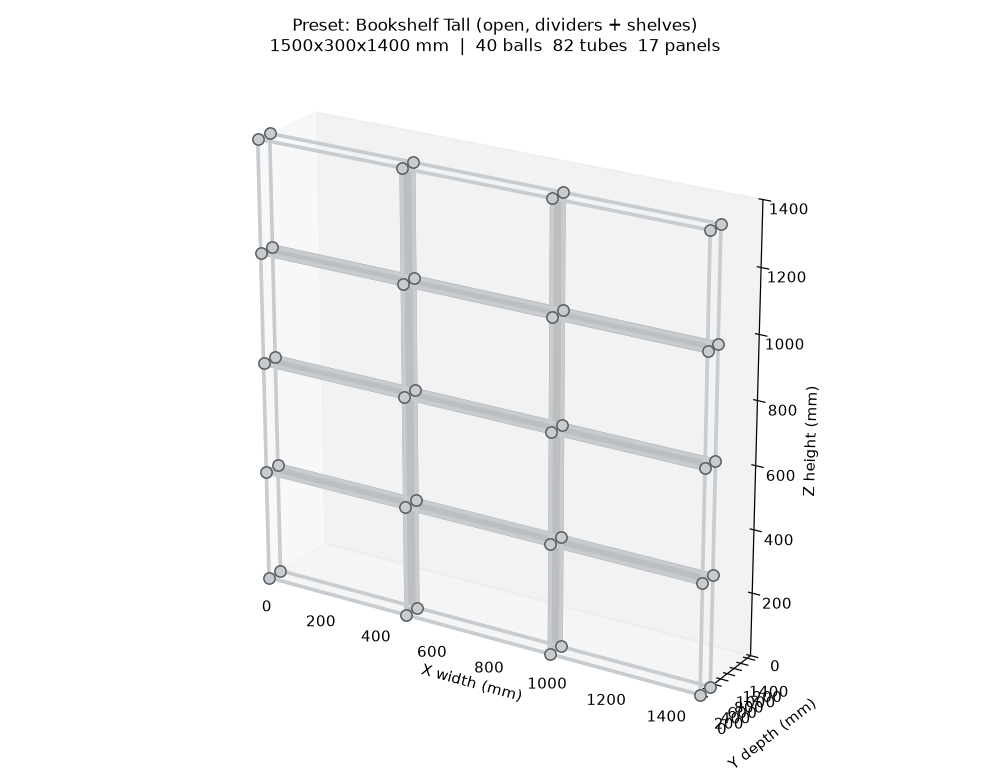
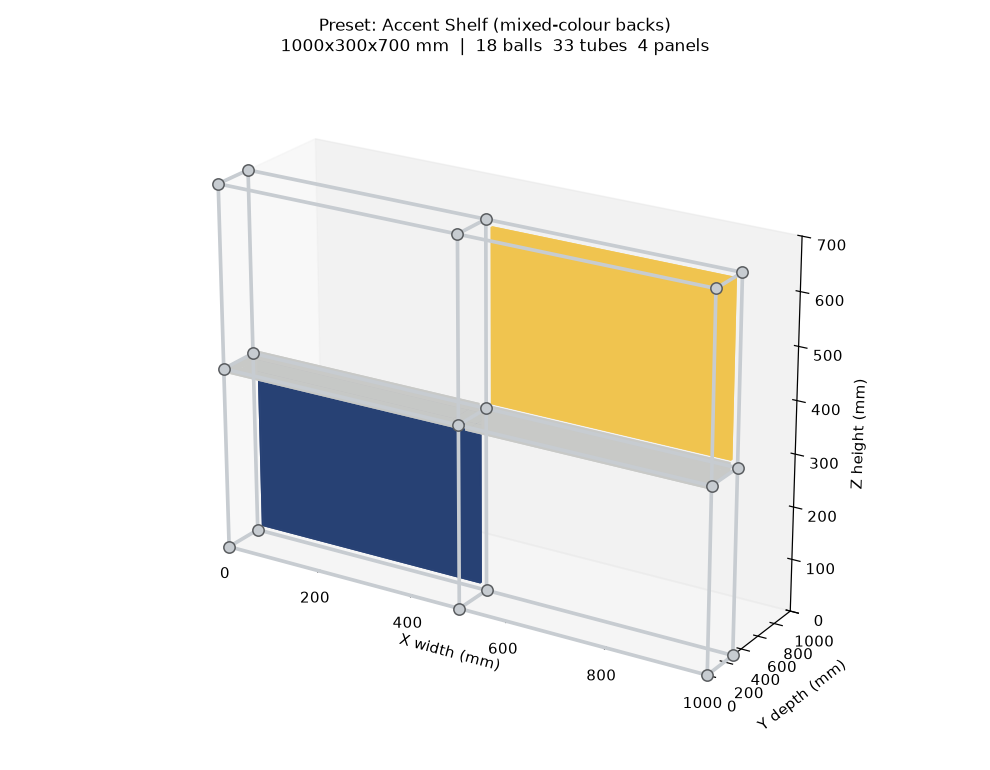

# USM Configurator

A standalone Fusion 360 add-in that builds **parametric USM Haller–style modular
furniture** from a configuration dialog: a 3D grid of chrome **ball connectors**,
**tubes** along every grid edge, and powder-coated steel **panels** (backs,
shelves, dividers) in any of the USM colours.

It is **independent of the ClaudeCad chat add-in** — its own command, dialog and
geometry — but its builder **reuses ClaudeCad's proven CAD engine** when that
add-in is present, for design binding, unit handling and material assignment.

*Previews rendered straight from `usm/geometry.py` — the same balls, tubes and
panels the Fusion builder turns into solids. Left: the Bookshelf Tall preset
(open lattice, shelves + dividers). Right: the Accent Shelf preset, showing
per-cell coloured back panels.*

## Workflow

1. **Utilities → Add-Ins → Scripts and Add-Ins → `UsmConfigurator` → Run.**
2. Click **USM Configurator** in the Add-Ins panel — the dialog opens.
3. Pick a **Preset**, or set **Custom**: columns × rows × depth, cell sizes, the
   ball/tube diameters, panel thickness, which bays carry **back panels /
   shelves / dividers**, and a **panel colour**.
4. **OK** builds the structure in the active design and reports the bill of
   materials (balls, tubes + total length, panels + area).

## How it works

| Piece | Responsibility |
|-------|----------------|
| `UsmConfigurator.py` | Fusion entry point (`run`/`stop`); fresh-imports the package each Run. |
| `usm/geometry.py` | **Pure** USM maths: a config → balls, tubes, panels + BOM. No `adsk`; unit tested. |
| `usm/presets.py` | **Pure** preset catalogue (bundled + `~/.usmconfigurator/presets.json`). |
| `usm/builder.py` | Fusion build: spheres/cylinders/boxes via `TemporaryBRepManager`, colours/materials. Reuses ClaudeCad's engine. |
| `usm/ui.py` | The configurator command + dialog and its handlers. |
| `usm/addin.py` | Add-in lifecycle (create/remove the command + button). |
| `resources/presets/usm.json` | Bundled starting configurations (sideboard, bookshelf, credenza, …). |

The geometry layer is deliberately Fusion-free so the layout logic — grid nodes,
edge tubes, panel placement, the BOM — runs and is tested without the host
(`python tests/test_usm.py`).

### Reusing the ClaudeCad engine

`usm/builder.py` imports `claudecad.cad.CadBuilder` (the engine that powers the
ClaudeCad add-in) and uses it for the mm→cm unit constant and for assigning a
physical material to the built bodies. It first tries a normal import, then looks
for a sibling `ClaudeCad/` add-in folder and adds it to `sys.path`. If the engine
isn't found, the builder runs **standalone** with local fallbacks (geometry is
identical; materials become best-effort) and says so in its report.

## The model

* **Grid** — `columns`, `rows` and `depths` are lists of bay sizes (mm) along
  X (width), Z (height) and Y (depth). Node coordinates are their running sums,
  so a 2-column × 1-row × 1-deep config has a 3 × 2 × 2 node grid.
* **Balls** — a chrome sphere (default Ø 25 mm) at every node.
* **Tubes** — a chrome cylinder (default Ø 19 mm) on every grid edge between
  adjacent nodes, in all three axes — the iconic USM lattice.
* **Panels** — steel panels (default 18 mm) inset within the tubes. Placed by
  rule (`back_panels`, `shelves`, `dividers`) and/or an explicit per-cell list
  in a preset (`{ix, iy, iz, face, color}`), with `face` one of
  `back/front/left/right/top/bottom`.

## Presets

Bundled in `resources/presets/usm.json` (Single Cube, Sideboard, Credenza,
Bookshelf, TV Board, an accent-colour example). Add your own to
`~/.usmconfigurator/presets.json` (same schema, a `presets` list) — user entries
override bundled ones with the same `id`.

## Install

From a terminal **inside the `UsmConfigurator/` folder**:

- **macOS:** `bash install.sh`
- **Windows (PowerShell):** `powershell -ExecutionPolicy Bypass -File install.ps1`

The script copies the add-in into Fusion's AddIns folder. There are **no
dependencies** to install. (To get the richest material assignment, install the
sibling **ClaudeCad** add-in too — the builder will find and reuse its engine.)

Manual install: copy the `UsmConfigurator/` folder into

- Windows: `%APPDATA%\Autodesk\Autodesk Fusion 360\API\AddIns\`
- macOS: `~/Library/Application Support/Autodesk/Autodesk Fusion 360/API/AddIns/`

The folder, the `.py` and the `.manifest` must all be named `UsmConfigurator`.

## Notes & limitations

- Geometry inputs are **millimetres** (Fusion's internal unit is cm; the builder
  converts).
- Bodies are committed through a single **base feature** in a parametric design
  (added directly in a direct-modelling design). Re-running adds another build;
  `UsmBuilder.clear()` removes the tagged bodies of a previous build.
- Tubes are modelled **centre-to-centre** with balls overlaid at the nodes (as
  USM tubes seat into the connectors) — clean and exact, no sketch-plane
  guesswork.
- Appearance/colour assignment copies a base appearance from your installed
  material libraries and recolours it; it's best-effort and skipped silently if
  your libraries don't expose a suitable base.
- Requires an active Fusion design.

## Tests

`python tests/test_usm.py` runs the offline contract suite (no Fusion needed);
`tests/SMOKE.md` is the manual in-Fusion checklist.
